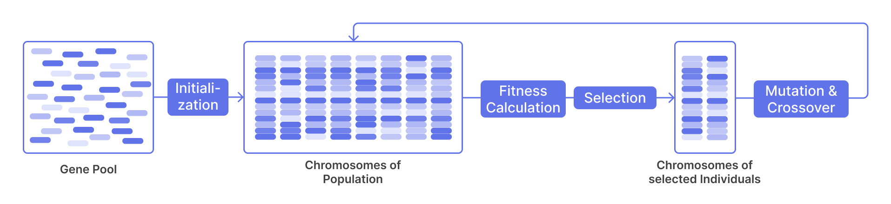
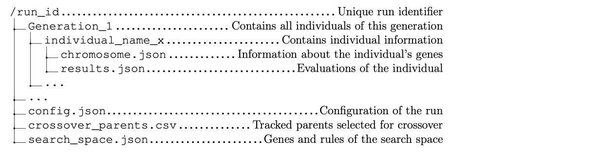
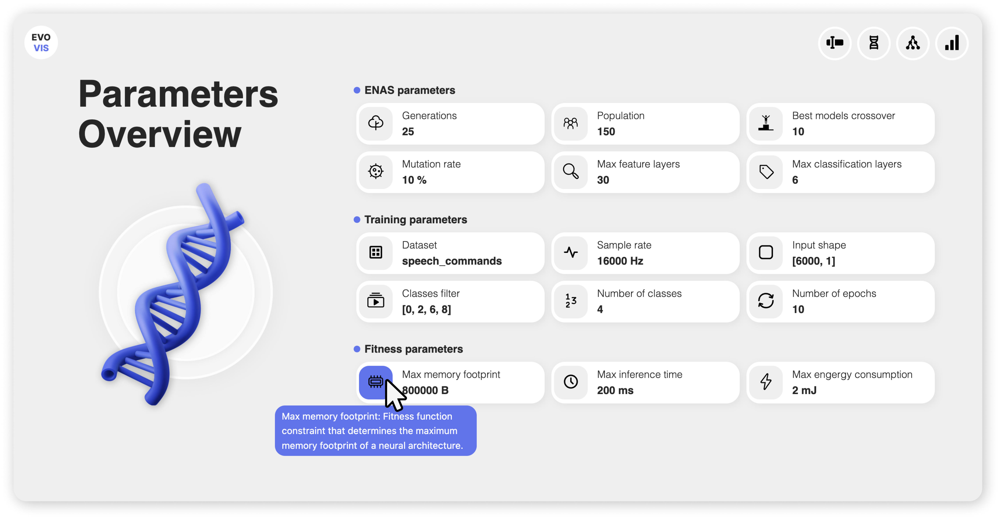
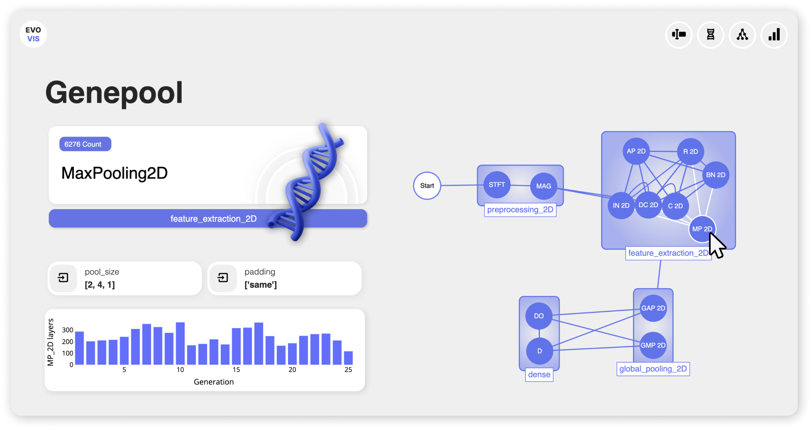
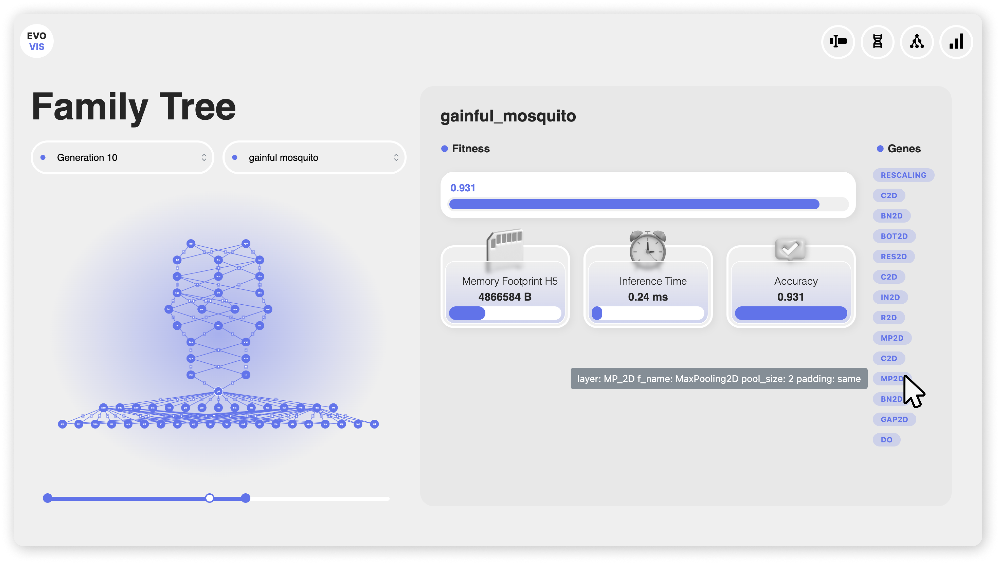
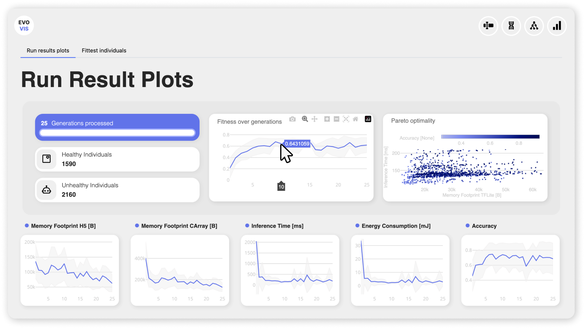

# Summary

EvoVis is a dashboard designed to visualize the key components of Evolutionary Neural Architecture Search (ENAS) algorithms. ENAS is an optimization method that mimics biological evolution to optimize one or multiple objectives, ultimately discovering novel neural network architectures tailored to specific tasks. EvoVis offers a holistic view of the ENAS process: It provides insights into hyperparameters, potential neural architecture topologies, the family tree of architectures across generations, and performance trends. Key features include interactive gene pool and family tree graphs, as well as performance plots for monitoring the ENAS runs. The dashboard's generic data structure interface facilitates integration with various ENAS algorithms. The code is available at [https://github.com/ankilab/EvoVis](https://github.com/ankilab/EvoVis).  

# Statement of need

In the past few years, the field of data science has gained a lot of attention in the public media, industry, and academia. One essential part is the rise of deep learning with neural networks as the state-of-the-art method for solving a variety of high cognitive and, up to now, hard-to-automate tasks [@lecun2015deep; @NAS-1000-paper-review]. However, one drawback of these models is that the architectural design is a bottleneck in the overall performance as manual design approaches involve time-consuming trial-and-error processes [@NAS-1000-paper-review]. They lack the expertise and depth of exploration required to tackle complex applications, especially those with multiple conflicting optimization objectives. This limitation has spurred the rise of automated approaches for discovering neural architectures, known as Neural Architecture Search (NAS) algorithms [@NAS-review-efficient-performance-prediction]. The use of NAS not only reduces the manual effort required, but also enables a more efficient exploration of the architectural search space, which in turn leads to the generation of superior models for specialized tasks.  

Beside others (reinforcement learning [@NAS-reinforcement-learning], Bayesian optimization [@NAS-BANANAS]), Evolutionary Neural Architecture Search (ENAS) is one NAS optimization method which mimics biological evolution relying on the principle of survival of the fittest. Initially, the algorithm selects a starting population from the given gene pool (search space). In each generation, including the initial one, every individual in the population is evaluated to determine its fitness. The processes of selection, crossover (combining the structure of high-performing architectures), and mutation (introducing random structural changes) are then applied to progressively enhance the objective value (fitness) over time until a stopping criterion is fulfilled [@EvoNAS-survey].  

ENAS algorithms have demonstrated remarkable success in generating state-of-the-art neural architectures [@EvoNAS-regularized-evolution-img-classifier; @EvoNAS-large-scale-evolution-img-classifier; @EvoNAS-CNN-design; @EvoNAS-NSGA-Net-multi-obj]. However, understanding their behavior and interpreting the results poses significant challenges. There is a need for comprehensive visualization of both the overall process and the individual neural architectures generated. First, the visualization of the process settings, from the hyperparameters to the search space of possible neural architectures, helps to understand the origins of the ENAS' run performances and the diversity of architectures explored which can be used for hyperparameter tuning. Secondly, visualizing a family tree of neural architectures enables researchers to investigate the network structure of individuals that have successfully inherited traits while converging toward an optimal solution. Finally, by visualizing aggregated performance trends of individuals across generations, researchers can gain insight into the evolutionary trajectory and intervene if necessary.  

Popular machine learning tools like TensorBoard, Neptune, and MLFlow excel at visualizing certain aspects of the ENAS pipeline, such as real-time monitoring of training metrics and visualizing model architectures [@tensorboard; @ML-tracking-frameworks]. However, they lack the capability to track the relationships and evolutionary progress of architectures over time. This gap underscores the need for a comprehensive tool that integrates all these features, which EvoVis is specifically designed to provide.  

# EvoVis Key Features

This paper presents a new dashboard tailored for ENAS algorithms named EvoVis. EvoVis provides continuous updates on performance metrics for concurrent trend analysis and quick identification of issues. EvoVis is built with `Plotly Dash`, enabling rapid development of interactive web applications with minimal code, seamless integration with CSS and frameworks like `Bootstrap` and `Mantine` for a polished user interface, and support for interactive graph components like `Cytoscape.js` to provide dynamic visualizations of the gene pool and family tree graphs for enhanced user interaction.  

## Generic Interface

EvoVis features a generic interface by accepting a standardized data structure as input to ensure compatibility with different ENAS algorithms. EvoVis requires the ENAS run to output a directory named according to a selected run identifier. The run directory contains subdirectories representing all generations that have been processed. The generation subdirectories store each individual of the generation along with its fitness values and the chromosome specifying the individual's neural architecture. In addition to the collection of generations, a configuration file containing the hyperparameters, a crossover log, and the search space configuration specifying the gene pool directed acyclic graph (DAG) is stored in the run directory. A more detailed description of the folder and file structure as well as a sample dataset is provided in the documentation of EvoVis.  

## Hyperparameter Overview

The default view of EvoVis is the `Hyperparameters` page, which enables users to understand the configurations of an ENAS run and provides clarity on the inputs that influence the evolutionary trajectory from the beginning. Users can access additional descriptions by hovering over the hyperparameter component icons, revealing tooltips that clarify the purpose of each hyperparameter. This comprehensive experiment logging enhances reproducibility, thereby increasing the reliability of research results [@ml-reproducability].  

## Gene Pool Graph

The `Gene Pool` page generates a graph representing potential neural architectures that form each individual and thus each population of an ENAS run. Each chromosome is derived from this gene pool, resulting in a wide variety of neural architectures. This feature serves both as an analytical support and as an experiment log of ENAS experiments [@ml-reproducability]. It not only captures the logic of the search space but also presents it in a comprehensive graph format. This automated visualization of the DAG reduces the time spent manually identifying the structure, thereby enhancing reproducibility by transparently documenting the exploration of the architectural space. 

## Family Tree Graph

Another component of EvoVis is a family tree, which illustrates the relationships between different architectures, allowing users to quickly identify the ancestors of each architecture. By navigating through the family tree, users can access performance metrics and chromosomes for each architecture. This feature facilitates tracing the lineage of successful architectures and helps diagnose training problems by enabling fine-grained analysis of the evolutionary process.  

## Run Results Plots

Arguably the most important page in EvoVis is the `Run Results` page, which provides an aggregated analysis of an ENAS run. This page features a variety of plots, including performance metrics across generations, fitness values and accuracies as well as metrics like power consumption and memory usage. For multi-objective problems, a graph illustrating the trade-off between competing objectives in the fitness function is presented so that users can identify optimal solutions. Additionally, the run results include the best individuals of each generation, along with their corresponding architectures and performance evaluations.  

# Conclusion

We present EvoVis, a novel dashboard for visualizing hyperparameters, gene pools, family trees, and optimization results of ENAS algorithms. By providing an intuitive Python-based interface, EvoVis aims to improve the workflow of researchers developing innovative ENAS algorithms. Future work will extend its capabilities to include visualizations of results from prominent ENAS algorithms, fostering greater integration with the existing literature and increasing the utility of EvoVis for the ENAS community.  

# Acknowledgments

We would like to thank Mateo Avila Pava and Stefan Dendorfer for their valuable feedback during the development phase of EvoVis. We receive funding from the Bavarian State Ministry of Science and the Arts (StMWK) and Fonds de recherche du Québec (FRQ) under the Collaborative Bilateral Research Program Bavaria – Québec managed by WKS at Bavarian Research Alliance (BayFOR) and Fonds de recherche du Québec – Santé (FRQS). The presented content is solely the responsibility of the authors and does not necessarily represent the official views of the above funding agencies.  
